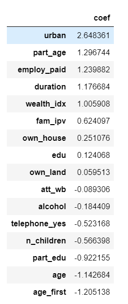

# MACS 30123 Final Project: Predicting Intimate Partner Violence in South Asia Using Data From the Demographic and Health Surveys

1. [Introduction](#Introduction)
2. [Data](#Data)
    1. [Outcome Variable](#OutVar)
    2. [Exploratory Data Analysis](#EDA)
    3. [Predictive Features](#Pred)
3. [Results and Analysis](#res)
    1. [Logistic Regression](#logit)
    2. [Random Forest](#rf)
        1. [Feature Importance](fi)
4. [Conclusion](#conclude)
5. [Appendix](#app)
6. [Reference](#ref)

## Introduction 

Intimate partner violence (IPV) is a common form of violence against women and violation of human rights. It has become an increasingly salient social problem during the Covid-19 because potential victims of IPV now have to spend more time with their perpetrators at home due to the lockdown (Evans et al, 2020). This "pandemic within a pandemic" (Evans et al, 2020) merits serious scholarly attention. For governments, development agencies and non-profit organizations that promote human rights, a key question is how to accurately identify potential victims. Better targeting has important policy implications since it can inform the allocation of scarce financial and human resources to provide social support and protection. In addition to an improvement on aid targeting, these organizations can also benefit from the research insights into what socioeconomic and demographic features distinguish victims from non-victims. These insights can be used to facilitate policy interventions that seek to address this issue along a certain dimension such as increasing women’s employment or shifting discriminatory social norms against women. In this report, I used nationally representative survey data from three South Asian countries (India, Pakistan and Nepal) to train machine learning models able to accurately identify women vulnerable to IPV and to examine socioeconomic and demographic features predictive of IPV.

## Data 

The datasource for this research project is the Demographic and Health Surveys ([DHS](https://dhsprogram.com/topics/)). It contains a series of nationally representative surveys collected by the United States Agency for International Development. For the three South Asian countries of interest, the most recent available surveys were collected in 2016 (India and Nepal) and 2018 (Pakistan). Bangladesh was not included for there is no available information on IPV in Bangladesh. The combined dataset contains 740,000 records for women aged 15 to 49 and currently in union at the time of interview. Unfortunately, after filtering out women who were not interviewed for their experience of IPV, I found that there are only around 73,000 records available for analysis. Among these 73,000 available records, around 90% is from India and the rest 10% is about equally distributed between Pakistan and Nepal.

I used Dask to perform the task of data cleaning, exploratory data analysis, building and evaluating machine learning models in parallel. Given that Dask does not have all the functionality sklearn has, I occasionally used less parallelizable implementation from sklearn. For data cleaning, a fair amount of time was spent on reading the documentation of DHS variable coding to identify features of interest.

### Outcome Variable 

The outcome variable of interest is whether a woman experienced IPV. DHS measures three types of IPV: 1) sexual violence; 2) emotional violence; 3) physical violence. For each type of violence, survey enumerators ask a set of behavioral questions to assess whether a woman experienced this type of violence in the past 12 months (see the Appendix for details). If a woman answers yes to any of the behavioral question, survey enumerators will record 1 on the indicator variable for this type of violence. I constructed a combined indicator variable `violence` to measure whether a woman experienced any of the three types of IPV in the past 12 months. This variable has value 1 to denote that a woman experienced at least one type of IPV in the past 12 months and 0 otherwise.

The figure below displays the distribution of IPV in the combined dataset. Since the data contains more records for women who did not experience IPV (around 70%), I performed a down-sampling of majority label in the data splitting stage to obtain a balanced training set.

### Exploratory Data Analysis 

I conducted exploratory data analysis to facilitate feature engineering. The figures below inform me on potential feature engineering choices.

From the Figure 2 above, we can see that women whose father ever beat her mother are more likely to experience IPV. Family history of IPV might be predictive of women's experience of IPV today.

Additionally, women whose partner drinks alcohol are more likely to experience IPV. This suggests that partner's alcohol consumption might be another informative feature.

Figure 4 and 5 above shows that women who experienced IPV are more likely to be less educated and have less educated partners. Women's years of education and that of her partner might be useful features for prediction as well.

### Predictive Features 

Based on exploratory data analysis above and past studies about other potential socioeconomic factors (Heise et al, 2015), I used the following variables to predicit women's experience of IPV:

- Individual-level features:
  - Woman's features:
    - `age`: a woman's age at the time of interview
    - `age_first`: a woman's age at start of her first marriage or union
    - `duration`: the duration of a woman's marriage
    - `urban`: 1 if a woman is residing in urban area, 0 otherwise
    - `edu`: years of education for a woman
    - `n_children`: the number of children resident in a woman's household and aged 5 and under
    - `employ_paid`: 1 if a woman was employed and paid in the past 12 months, 0 otherwise
    - `own_house`: 1 if a woman owned house at the time of interview, 0 otherwise
    - `own_land`: 1 if a woman owned land at the time of interview, 0 otherwise
    - `att_wb`: 1 if a woman agrees that wife-beating is justified for at least one reason lised in the survey, 0 otherwise
    - `fam_ipv`: 1 if a woman's father ever beat her mother, 0 otherwise

  - Partner's features:
    - `part_age`: partner's age at the time of interview
    - `part_edu`: years of education for a woman's partner
    - `alcohol`: 1 if a woman's partner drinks alcohol, 0 otherwise

- Household-level features:
  - `wealth_idx`: a five-level household wealth measure
  - `telephone_yes`: 1 if a woman's household has a telephone, 0 otherwise

The details of these variable can be found in DHS (2021).

All continuous features are normalized (Min-Max scaling) before data spliting. In the splitting stage, I sampled 80% of the positive class into the training set and down-sampled the negative class (majority).

## Results and Analysis 

I applied logistic regression and random forest to predict women's experience of IPV. The best model from each model class is selected through five-fold cross-validation and grid-search.

### Logistic Regression 

ROC Curve for the Best Logistic Regression Model

The best logistic regression model by cross-validation has 75.5% accuracy and 0.745 AUC score. This performance is satisfactory as it has outpeformed the baseline, which is the proportion of majority label (around 70%). To measure how well the model performed on identifying women who actually experienced IPV, I calculated the recall score for the best model. The recall score (0.584) indicates the model's performance on this task is substantially better than the baseline score, the proportion of positive cases (around 0.3). Overall, the result shows the promises of using machine learning approaches to improve the accuracy of aid targeting.

The coefficient table below displays the coefficients associated with each feature. Some features with large coefficients include urban residency, partner's age, whether a woman was employed and paid, a woman's age and her age at the start of the first marriage or union, and her partner's years of education.

### Random Forest 

Compared with the best logistic regression model, the best random forest model has a higher accuracy (0.764 vs 0.755) and a higher AUC score (0.748 vs 0.745). However, we might prefer a model with a higher recall score from a policy perspective since a higher recall score indicates better performance on correctly identifying women who were actual victims of IPV. The best random forest model is outperformed by the best logistic regression model on recall score (0.578 vs 0.584). Using a more flexible model like random forest does not lead to substantial improvement on the predictive performance.

#### Feature Importance 

I used feature importance as a metric to examine what features are predictive of women's experience of IPV in both the pooled dataset and country-specific datasets. For the former, feature importance is measured by mean decrease in post-splitting node impurity and calculated on training data. For the latter, I calculated the permutation importance on each country-specific testing set. If a variable is predicitve of IPV, a random shuffle of it is likely to reduce the information in the data and thus lower the prediction accuracy. In this case, we will observe a positive permutation importance estimate, indicating the magnitude of decline in the prediction accuracy after permuting the feature of interest. If a feature is not predictive, its permutation importance might be around 0 or even lower.

The feature importance plots for the pooled dataset suggests that family history of IPV and partner's consumption of alcohol are the two most informative features. Other noticeable features include a woman's years of education, her partner's years of education, their family's wealth level and a woman's attitude toward wife-beating. The last variable can also be considered as a proxy of how social norms are discriminatory against women.

For the Pakistan dataset, family history of IPV is still the most important feature but partner's alcohol consumption now becomes uninformative. This probably can be explained by the fact that Pakistan has a large Muslim population that does not drink alcohol.

For India, family history of IPV and partner's consumption of alcohol are still the two most important features but the variable, women's attitude toward wife-beating, is no longer important.

For Nepal, family history of IPV remains important but the rest of features seem to be less predictive.

## Conclusion 

In this analysis, I used a relatively small set of features (16 in total) to predict whether a woman is likely to experience IPV in South Asia. With this information, I acheived 76.4% overall accuracy (random forest), which outperforms the baseline (70%) by about 10%. I also successfully identified 58.4% of the women who actually experienced IPV (logistic regression). This result shows the promise of using machine learning to better target social protection and support resources toward women vulnerable to IPV. Additionally, I discovered that family history of IPV is the most informative feature of IPV cases across all countries of interest. This can be interpreted as the intergenerational effect of IPV or a manifestation of the impact of social norms that tolerate IPV and discriminate against female victims. Other predictive socioeconomic and demographic features include alcohol consumption by a woman's partner, a woman's years of education, her partner's years of education, their family's wealth level and a woman's attitude toward wife-beating. Future studies need to examine the direction of impacts by policy interventions on those variables to better understand the mechanism through which women are protected against or hurted by IPV.

## Appendix 

### Behavioral Questions for IPV

- Behavioral Questions for Emotional Violence
  - Did your spouse ever humiliate you?
  - Did your spouse ever threaten you with harm?
  - Did your spouse ever insult you or make you feel bad?

- Behavioral Questions for Physical Violence
  - Did your spouse ever push, shake or throw something?
  - Did your spouse ever ever slap you?
  - Did your spouse ever punch you with fist or something harmful?
  - Did your spouse ever kick or drag you?
  - Did your spouse ever try to strangle or burn you?
  - Did your spouse ever threaten you with knife/gun or other weapon?
  - Did your spouse ever attack you with knife/gun or other weapon?
  - Did your spouse ever twist you arm or pull your hair?

- Behavioral Questions for Sexual Violence
  - Did your spouse ever physically force sex when not wanted?
  - Did your spouse ever force other sexual acts when not wanted?

## Reference 

DHS. (2021) “DHS Methodology”. Available at: https://dhsprogram.com/What-We-Do/Survey-Types/DHS-Methodology.cfm#CP_JUMP_1615 . Accessed: 2021-06-03.

Evans, Megan L., Lindauer, M. and Farrell, M.E. (2020). "Pandemic within a Pandemic — Intimate Partner Violence duringCovid-19".*New England Journal of Medicine*, 383(24):2302–2304.

Heise, L. L., Kotsadam, A. (2015). "Cross-national and multilevel correlates of partner violence: An analysis of data from population-based surveys". *The Lancet Global Health*, 3(6), e332–e340. doi: 10.1016/S2214-109X(15)00013-3